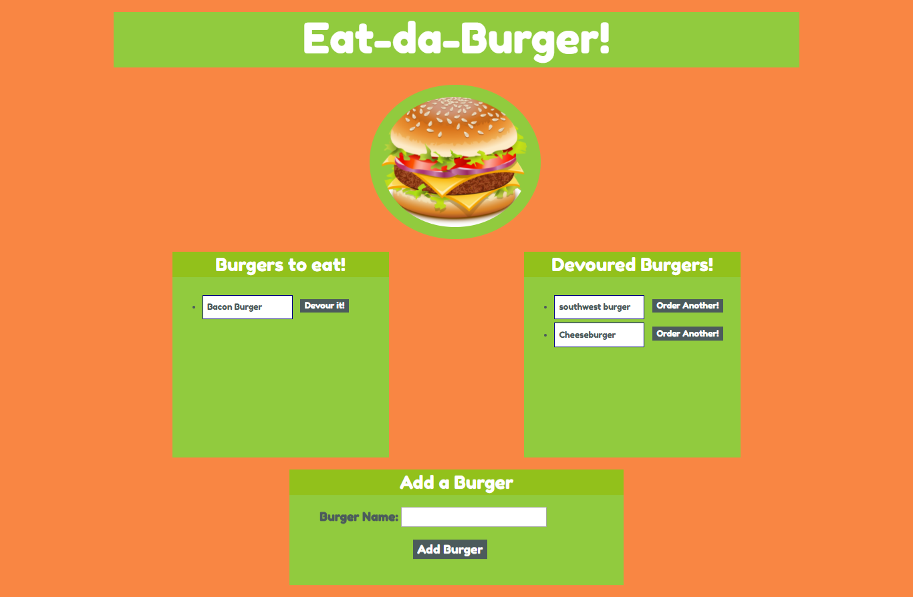

# Eat da Burger 2.0

This application recreates the Burger application but utitlizes the node management package Sequelize to call the routes rather than creating orm functions. 

The application allows the user to enter in a burger. Once the burger is entered it is added to a SQL database. 

The entered burger now appears in on the screen under the to be devoured section. 

Here the user can push the "devour" button and the burger will move to the other side of the screen.

Once the burger moves to this side of the screen the user can order another one and then the burger moves back across the screen. 

## Languages and Packages Used

This application uses HTML, CSS, Bootstrap, JavaScript, and mySQL.

The npm packages used are Sequelized, Handlebars, Express, mysql, Body-Parser, and method-override
